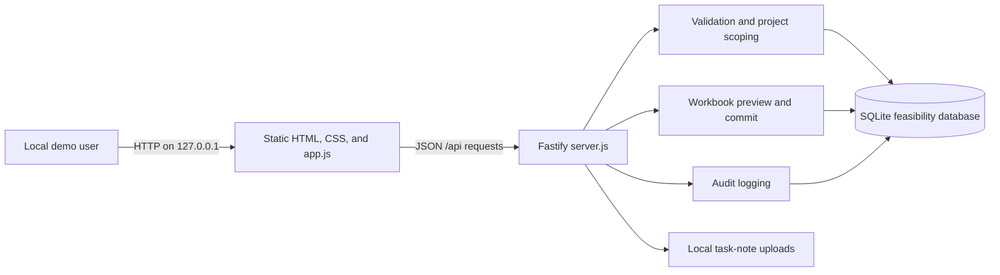
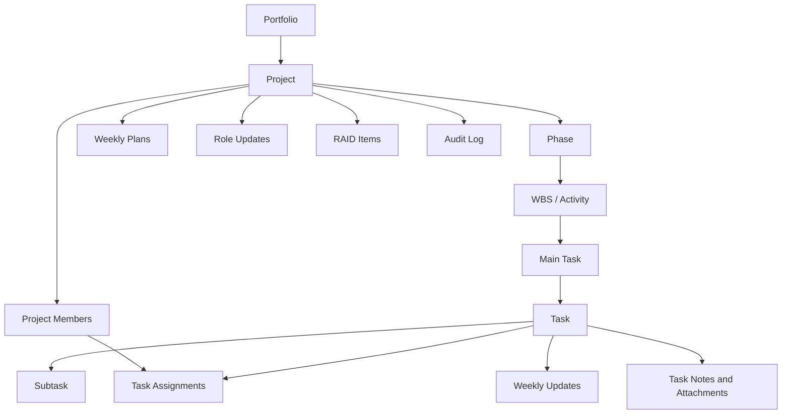

# Lean Project Control — Design and Architecture

## 1. Purpose

Lean Project Control is a governance and delivery-control workspace for portfolios, projects, WBS structures, tasks, assignments, weekly reporting, workload, RAID, evidence, and audit history. RRMS is the first pilot context.

The repository contains two related designs:

- **Current implementation:** a localhost, single-user feasibility walkthrough backed by SQLite.
- **Target direction:** a shared pilot with verified identity, server-side RBAC and data scoping, PostgreSQL, controlled migrations, evidence governance, and operational safeguards.

These states must not be conflated. The current walkthrough validates workflows and data shapes; it is not a security or production architecture.

## 2. Current Architecture



The Fastify process serves both the browser assets and the API. It opens one SQLite database through `better-sqlite3`, enables foreign keys and WAL mode, and stores task-note files beside the local database. Most API, validation, import, and persistence logic currently lives in one process and one source file.

### Runtime components

| Component | Location | Responsibility |
| --- | --- | --- |
| Browser shell | `apps/web/index.html` | Navigation, content host, dialog, and toast containers. |
| Browser behavior | `apps/web/app.js` | API calls, rendering, forms, modal workflows, and client-side interaction. |
| Styles | `apps/web/*.css` | Layout, components, admin views, dialogs, and buttons. |
| API/application service | `apps/api/server.js` | HTTP routes, validation, SQL, demo identity resolution, imports, files, and audits. |
| Feasibility store | `database/sqlite/` and `data/*.db` | Executable local schema/reference data and mutable walkthrough state. |
| Verification | `tests/api-smoke.test.js` | HTTP-level behavior against a temporary isolated database. |
| Target relational design | `database/migrations/`, `database/schema.md` | PostgreSQL-oriented shared-pilot model. |

## 3. Domain Model

The core hierarchy is:



People exist independently from user accounts and project membership. A person may join multiple projects and may receive multiple assignments. Parent-child task hierarchy is separate from task dependency sequencing. Evidence, baselines, change requests, RBAC mappings, and custom fields are represented in the logical/target model, but not all are complete runtime workflows.

## 4. Request and Data Scope

The browser calls relative `/api` endpoints. The API resolves a local demo actor and a project context, validates the target resources, performs parameterized SQLite operations, and records material mutations in `audit_logs`.

The current identity flow selects an active seeded account through `DEMO_LOGIN_NAME`. When explicitly enabled for automated tests, `x-demo-login` can select another seeded account. This proves neither identity nor permission and must remain restricted to localhost/testing.

The target authorization sequence is:

1. Cryptographically verify the caller through the approved identity provider.
2. Map the external identity to an active `user_accounts` and `people` record.
3. Resolve active roles, permissions, project membership, and workstream/task scope.
4. Authorize the resource and action on the server.
5. Validate domain invariants.
6. Commit the business mutation and audit event atomically.

The UI may hide or disable controls for usability, but it is never the authorization boundary.

## 5. Key Invariants

- Project codes and other scoped codes that are modeled as unique must not collide among active records.
- Task hierarchy must remain within one project and WBS. A `Task` requires a `MainTask` parent; a `Subtask` requires a `Task` parent; cycles are invalid.
- Task owners and assignees must be active members of the same project.
- Planned and actual date ranges must be internally ordered where both dates exist.
- Progress remains within 0–100; a `Done` task has 100% progress.
- Dependency edges cannot point to the same task, cross projects, or form cycles in the target design.
- Evidence-required completion must eventually enforce the approved evidence/review rule; that policy is still a PM decision.
- Imports are previewed and validated before commit. Any validation error prevents all imported mutations.
- Audit history is append-only. Deletes are soft deletes where modeled, and sensitive changes carry actor and before/after context.
- Project deletion in the target design requires both permission and active Main PM ownership, a reason, and an atomic audit entry.

## 6. Persistence Strategy

### SQLite feasibility path

SQLite is appropriate only for the local single-process walkthrough. The database URL must use the `file:` scheme. The server enables foreign keys and WAL journaling. Tests create a temporary database, initialize it from SQLite migrations/seeds, and remove it after the suite.

Some compatibility schema creation and column upgrades currently happen during server startup. This supports existing local databases but creates drift risk. New evolution should move toward ordered, idempotent migration execution with a migration-history table.

### PostgreSQL target path

PostgreSQL 16 is available through `infra/docker-compose.yml` as the intended shared-pilot database. The current Fastify server rejects non-`file:` database URLs, so starting PostgreSQL does not switch the application to PostgreSQL. Moving to it requires a database adapter/repository boundary, migration runner, connection and transaction management, backup/restore procedures, secrets handling, and concurrency testing.

Equivalent SQLite and PostgreSQL migrations should express the same business model while respecting dialect differences. Docker initialization scripts run only for a new volume and are not a migration mechanism for an existing database.

## 7. API Design

The executable walkthrough exposes unversioned `/api/*` routes. The draft target contract in `docs/api-contracts/openapi.yaml` uses `/api/v1` and includes broader secured capabilities. The contract is therefore directional rather than a complete description of the current server.

Conventions for new and modified endpoints:

- Use scoped resource lookup so an ID from another project behaves as unavailable to the caller.
- Use parameterized SQL and explicit transactions for related writes.
- Return JSON errors as `{ "message": "..." }`.
- Use `401` for unresolved identity, `403` for permission/scope denial, `404` for a missing scoped resource, `409` for uniqueness/state conflicts, and `422` for business-rule violations.
- Audit the actor derived from request identity, not an actor supplied in the request body.
- Coordinate breaking field/route changes across the UI, tests, import utilities, OpenAPI, and data documentation.

## 8. Import and Attachment Boundaries

Workbook import is a two-step preview/commit workflow. Uploaded workbook size is limited, rows are normalized and validated, and commits should remain all-or-nothing. Template specifications and workbook-building scripts are under `docs/` and `scripts/`; generated review artifacts are under `outputs/`.

Task-note attachments are local feasibility files with a 5 MiB limit. Filenames must be sanitized, storage references must stay inside the configured upload root, and download access must be project-scoped. A shared pilot needs approved object storage, malware scanning, content-type handling, retention, authorization, and backup policies.

## 9. Frontend Design

The frontend intentionally has no build step or framework. `index.html` provides the shell; `app.js` renders page content and handles workflows; CSS files divide broad styling concerns. This keeps the feasibility app easy to run but makes `app.js` a growing concentration point.

Near-term changes should preserve the simple stack and extract small modules only when doing so directly improves a requested feature or testability. All user-originated values rendered into HTML must be escaped or inserted through safe DOM APIs. UI work must preserve keyboard navigation, form labels, dialog focus, visible status states, contrast, and narrow-screen usability.

## 10. Quality Strategy

The baseline checks are:

```powershell
npm run check
npm test
```

The smoke suite exercises the server over HTTP with isolated storage. It should cover every changed invariant and failure path, especially identity, authorization, project isolation, hierarchy, membership, imports, auditing, attachment limits, and transactional behavior. Before a shared pilot, add browser workflow tests, accessibility checks, PostgreSQL integration tests, migration tests, and concurrency/recovery tests.

## 11. Security and Operational Posture

Current safeguards include localhost binding, ignored local data/secrets, parameterized database access in established flows, file-size limits, basic filename handling, project-aware lookups, and mutation auditing. These do not make the system production-ready.

Blocking gaps for shared use include verified authentication, enforced endpoint-level RBAC/data scope, a shared database, production secret management, TLS and proxy policy, evidence storage controls, rate/request protections, dependency and vulnerability review, centralized logging/monitoring, backup/restore testing, migration/rollback procedures, and user acceptance/accessibility testing.

## 12. Target Evolution

Recommended order:

1. Establish verified identity and centralized API authorization middleware.
2. Complete the approved role-permission and workstream scope rules.
3. Introduce a service/repository boundary and connect the application to PostgreSQL.
4. Add a real ordered migration runner and deployment/backup procedures.
5. Complete weekly review, evidence/Definition of Done, and all-or-nothing import policies.
6. Add browser, accessibility, PostgreSQL integration, and security tests.
7. Only then prepare a controlled shared-pilot deployment.

Open policy decisions remain authoritative in `docs/implementation-status.md`, `docs/requirements/mvp-scope.md`, and `docs/api-contracts/authorization-rules.md`.

