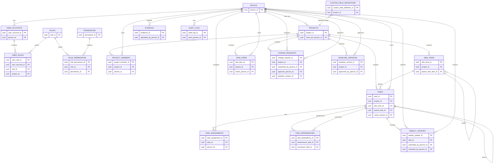

# Logical Data Model

Phase 2 logical model for Lean Project Control. It supports the RRMS pilot and is not a deployed database design. Fields and flows marked `TODO (PM Decision)` require PM confirmation before implementation.

## ERD

`Evidence` and `Audit Logs` use a polymorphic `related/entity` identifier. A relational foreign key is not possible for all target entity types; API validation must confirm that the referenced entity exists.

## Core Tables and Key Relationships

| Table | Primary key | Foreign keys | Notes |
| --- | --- | --- | --- |
| `people` | `person_id` | - | People Master; independent of authentication. |
| `user_accounts` | `user_account_id` | `person_id -> people` | Login identity. `password_hash` only; no plaintext password column. |
| `roles` / `permissions` | `role_id` / `permission_id` | - | Platform RBAC reference data. |
| `user_roles` | `user_role_id` | `user_account_id`, `role_id`, optional `project_id` | Supports multiple roles per account, optionally scoped to a project. |
| `role_permissions` | `role_permission_id` | `role_id`, `permission_id` | Many-to-many role-to-permission mapping. |
| `projects` | `project_id` | `main_pm_person_id -> people` | Uses `deleted_at`, `deleted_by_person_id`, and `deletion_reason` for soft deletion. |
| `project_members` | `project_member_id` | `project_id`, `person_id` | Project membership and project role; one active main PM per project. |
| `wbs_items` | `wbs_item_id` | `project_id`, optional `parent_wbs_item_id` | WBS hierarchy. |
| `tasks` | `task_id` | `project_id`, `wbs_item_id`, optional `parent_task_id`, `owner_person_id` | Main Task, Task, and Subtask hierarchy. |
| `task_assignments` | `task_assignment_id` | `task_id`, `person_id` | Multi-assignee with assignment role and RACI responsibility. |
| `task_dependencies` | `task_dependency_id` | `predecessor_task_id`, `successor_task_id` | Sequencing separate from parent-child hierarchy. |
| `weekly_updates` | `weekly_update_id` | `task_id`, submitter/reviewer person IDs | Captures RAG and review state. |
| `evidence` | `evidence_id` | `uploaded_by_person_id` | Metadata only; binary storage is outside MVP. |
| `raid_items` | `raid_item_id` | `project_id`, `owner_person_id` | Probability x impact supports scoring. |
| `change_requests` | `change_request_id` | `project_id`, requestor/approver IDs, optional `baseline_version_id` | Controlled changes after an approved baseline. |
| `baseline_versions` | `baseline_version_id` | `project_id`, optional `approved_by_person_id` | Immutable approved Project/WBS/Task snapshot. |
| `audit_logs` | `audit_log_id` | `actor_person_id` | Append-only record of sensitive/system actions. |
| `custom_field_definitions` | `custom_field_definition_id` | optional `project_id` | Platform-wide or project-scoped field definition. |

## Integrity Rules Requiring Service Validation

- A task owner and every task assignee must be an active member of the same project.
- A `Task` parent must be a `MainTask`; a `Subtask` parent must be a `Task`; circular relationships are rejected.
- A dependency cannot relate a task to itself and must remain within one project. Dependency cycles are rejected by API validation; critical-path scheduling remains out of scope.
- Only a person who is the active main PM may soft-delete a project. The deletion request requires a reason and creates an `audit_logs` row in the same service transaction.
- A task with `evidence_required = true` cannot be completed until evidence and review conditions are satisfied. **TODO (PM Decision):** identify the approving role and exact evidence-review state.
- A baseline snapshot is created when approved. **TODO (PM Decision):** confirm approval authority, fields frozen by baseline, and whether a change request must be approved before every change to a baseline-controlled field.
- **TODO (PM Decision):** confirm progress rollup weight rules, RAG definitions, weekly-review SLA, risk escalation threshold, evidence retention, and import update behavior.
